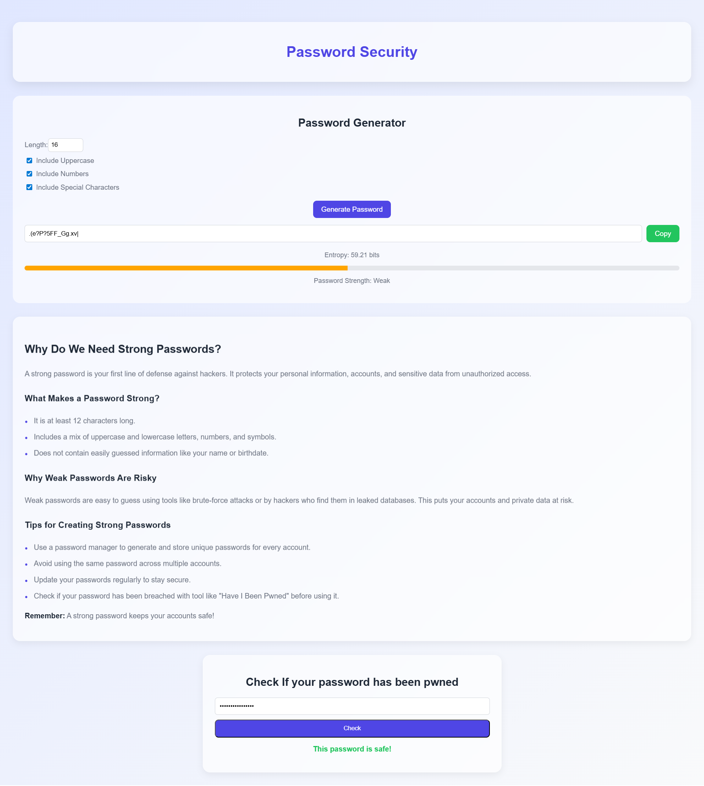

# 🔐 Angular Password Security Tool

A modern **Password Security Tool** built with **Angular 19** using **standalone components** and a **service-driven architecture**.  
It includes a **password generator**, **entropy & strength meter**, **pwned password checker** (via Have I Been Pwned API), and an **educational password guide** — all inside a clean, responsive, and modern UI.

---


## 🌐 Live Demo

👉 [Click here to try the app](https://ahmad-889.github.io/password-security/)

---


## 🎯 What I Built

This project is designed with **modular standalone components** for each feature, and a set of **services** to handle password generation, entropy calculation, and security checks.  
Here’s the breakdown:

* ✅ `PasswordGeneratorComponent`: Creates secure passwords based on user preferences  
* ✅ `EntropyService`: Calculates password entropy & strength  
* ✅ `PwnedPasswordCheckerComponent`: Checks if a password has been leaked using the Have I Been Pwned API (k-anonymity)  
* ✅ `PasswordExplanationComponent`: Educates users on best practices for password creation  
* ✅ Fully responsive, accessible, and mobile-friendly UI

---

## 💡 Key Features

* 🔑 **Customizable password generator** (length, uppercase, numbers, symbols)  
* 📊 **Entropy calculation** with real-time strength bar  
* 🛡 **Breach detection** via Have I Been Pwned API (SHA-1 k-anonymity)  
* 📖 **Password best practices** with tips and guidelines  
* 📋 **Copy to clipboard** functionality  
* 📱 Fully responsive design with a clean and modern aesthetic  

---

## 🧱 Technologies Used

* Angular 19 (Standalone Components)
* TypeScript
* SCSS (Modern UI styling)
* REST API integration (Have I Been Pwned)
* Clipboard API

---

## 📸 Screenshot



---

## 📁 Project Structure


```
src/
└── app/
├── components/
│ ├── header/
│ │ ├── header.component.ts # App header
│ │ ├── header.component.html
│ │ └── header.component.scss
│ ├── password-generator/
│ │ ├── password-generator.component.ts # Generates passwords
│ │ ├── password-generator.component.html
│ │ └── password-generator.component.scss
│ ├── password-explanation/
│ │ ├── password-explanation.component.ts # Displays tips & guidelines
│ │ ├── password-explanation.component.html
│ │ └── password-explanation.component.scss
│ └── pwned-password-checker/
│ ├── pwned-password-checker.component.ts # Checks breached passwords
│ ├── pwned-password-checker.component.html
│ └── pwned-password-checker.component.scss
├── services/
│ ├── entropy.service.ts # Entropy calculation logic
│ ├── password-generator.service.ts # Password creation logic
│ └── pwned-password.service.ts # Have I Been Pwned API integration
└── app.component.ts # Root component
```

## 🚀 Running the Project

Install Angular CLI if you haven't:

```bash
npm install -g @angular/cli
```

Install dependencies and serve:

```bash
npm install
ng serve
```

Visit `http://localhost:4200` to see the custom directives in action.

---

## 🔗 Author
Made with ❤️ by
Muhammad Ahmad
